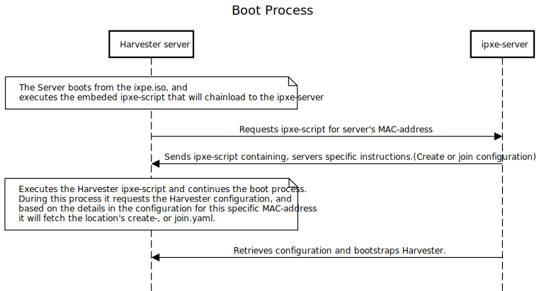

# HTTP iPXE Server

This iPXE server is capable of sending specific ipxe scripts, and harvester configuration files (config-create.yaml & config-join.yaml) to the requesting server, based on a MAC-address.  

It uses one configuration file containing the MAC-addresses and plant/region specific configuration.  

The server serves ipxe-scripts based on MAC-addresses, and those ipxe-scripts contain the correct config-create.yaml or config-join.yaml links for that specific server.  

This way it could be used as a bootstrap service for Harvester.

## Requirements

- iPXE script (see [example](#ipxe-script))
- data.yaml   (see [data.yaml](k8s/data.yaml))
- The binary from this code (check [how to build](#how-to-build))

## How it works

### iPXE script

Example of an ipxe-script that chainloads the specific ipxe-script:

    #!ipxe
    :loop
    set net0/ip 192.168.178.252
    set net0/netmask 255.255.255.0
    set net0/gateway 192.168.178.1
    ifopen
    iflinkwait --timeout 3000 net0
    ifstat
    chain http://192.168.178.7:10000/ipxe/${net0/hwaddr} || goto loop

What happens with the above script is that it sets a label with `:loop`, Then it sets an ipaddress, netmask and gateway for a specific interface. This depends on your setup, i.e. if you've got an interface that is let's say connected to the management vlan. Then the scripts brings the interface up with `ifopen`, waits for it to be up for 3000 milliseconds with `iflinkwait`. Prints the interface stats with `ifstat`, and proceeds by looking for another ipxe-script with `chain`. In that line the `${net0/hwaddr}` is replaced with the mac-address from that interface. If it fails it returns to the line with `:loop` and does it all again indefinitely.

#### HowTo

- Clone the git repository: git.ipxe.org/ipxe.git, and move into the ipxe directory:

        git clone git.ipxe.org/ipxe.git
        cd ipxe

- Create a file with the ipxe-script, i.e. example.ipxe (adjust where necesarry)
- Build your own ipxe.iso to boot from, execute:

        cd src
        make bin/ipxe.iso EMBED=../example.ipxe

  *Assuming you placed the example.ipxe in the directory where you cloned the ipxe git-repository.*

  If everything went well, the file `bin/ipxe.iso` has now the example.ipxe embeded, and when booting from that iso-file it will be executed by default.

Source: [https://ipxe.org/embed](https://ipxe.org/embed)

As I use Libvirtd (KVM) I define a cdrom device when I execute `virt-install`, and set the boot order to `hd,cdrom`. That way the machine will try to boot from disk - which is not possible (yet) - and proceeds to boot from the cdrom - the ipxe.iso file. Fetches the specific ipxe script for that machine, and continues with the installation. Upon the next boot the `hd` is bootable so it will boot from the fresh installed Harvester.

For baremetal servers it is quite often possible to set a onetime boot-device via the iDRAC or iLOM, so your preferred method to boot onetime from the generate ipxe.iso might be different.

### Configuration Data

Imagine the following:

- There are 2 locations, that have both an isolated Harvester Cluster setup. Let's call the `location_X` & `location_Y`.
- Both locations will have 3 Harvester Nodes.
- Both locations have their own specific configuration for about IP addresses, and maybe even network interfaces due to differences of hardware.

The configuration file consists of 2 main parts - `config` & `maclist`. Both are a list of objects, confguration objects, and a list of macaddresses that is used to provide each machine its specific ipxe-script and configuration.  
`config` contains a list of configuration

For more information regarding the specific configuration parameters for Harvester see: [https://github.com/harvester/docs/blob/main/docs/install/harvester-configuration.md](https://github.com/harvester/docs/blob/main/docs/install/harvester-configuration.md)

[Take a look](k8s/example_data.yaml) at an example configuration file showing different configuration for different locations.

### How To Build

Move to the root of this git-repository, and execute:

    go build

The result should be a executable in the root called; `phs`

### Deployment in Kubernetes (Kind)

Get kind:

    curl -Lo ./kind https://kind.sigs.k8s.io/dl/v0.11.1/kind-linux-amd64
    chmod +x ./kind

Move to the root of this cloned repository:

    cd k8s
    kind create cluster --config=kind-cluster.yaml --name phs
    kubectl create namespace phs
    kubectl create configmap --namespace phs --from-file=data.yaml
    kubectl create -f deployment.yaml
    kubectl expose deployment phs
    kubectl apply -f https://raw.githubusercontent.com/kubernetes/ingress-nginx/main/deploy/static/provider/kind/deploy.yaml
    kubectl create -f phs-nginx-ingress.yaml

From that point on you should be able to curl the server at http://localhost:80

    curl http://localhost/all

